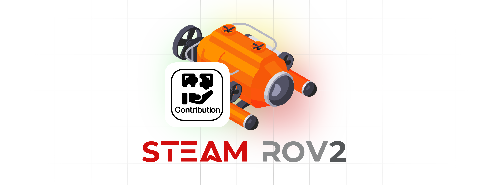

# ROV Project - Contribution List
<link rel="stylesheet" type="text/css" href="./markdown-resource/fontawesome/all.min.css">
<link rel="stylesheet" type="text/css" href="./markdown-resource/fontawesome/fontawesome.min.css">
<link rel="stylesheet" type="text/css" href="./markdown-resource/fontawesome/brands.min.css">
<link rel="stylesheet" type="text/css" href="./markdown-resource/fontawesome/solid.min.css">
<link rel="stylesheet" type="text/css" href="./markdown-resource/fontawesome/regular.min.css">
<link rel="stylesheet" type="text/css" href="./markdown-resource/fontawesome/thin.min.css">
<link rel="stylesheet" type="text/css" href="./markdown-resource/fontawesome/light.min.css">
<link rel="stylesheet" type="text/css" href="./markdown-resource/fontawesome/duotone.min.css">
<link rel="stylesheet" type="text/css" href="./markdown-resource/fontawesome/sharp-solid.min.css">

> Hong Kong Po Leung Kuk Ngan Po Ling College Steam Team Robotics ROV Team 2  
> Teammates: JP-YANG, Jasmine, Walter, Mark Chan, Kasey Chan

## ***Contribution List***
Contribution list will show in task-based form:
### Task 2: ESP32-LAN Communication-Computer
| Tasks                                                       | Contributor(s) |
| ----------------------------------------------------------- | :------------: |
| Build a basic TCP/IP communication between ESP32 & computer |     Walter     |
### Others

| Tasks                                                                  | Contributor(s) |
| ---------------------------------------------------------------------- | :------------: |
| Set of basic structure of the project                                  |   Jason Yang   |
| Set of basic git usage introduction and project regulation             |   Jason Yang   |
| Maintain the markdown files and readme guidelines keep project healthy |   Jason Yang   |
