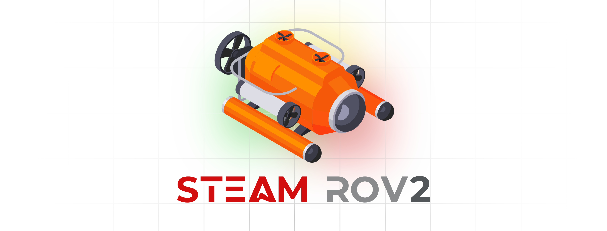
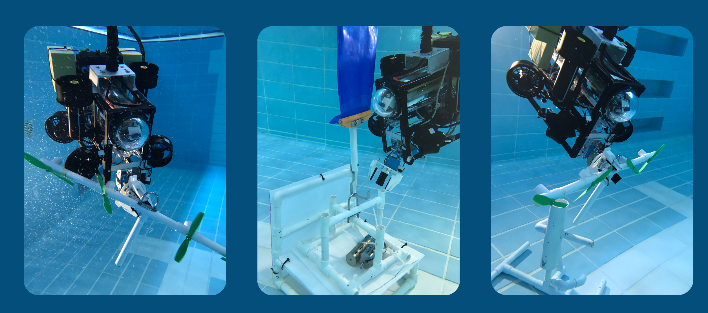

# STEAM 水下机器人项目
<link rel="stylesheet" type="text/css" href="./markdown-resource/fontawesome/all.min.css">
<link rel="stylesheet" type="text/css" href="./markdown-resource/fontawesome/fontawesome.min.css">
<link rel="stylesheet" type="text/css" href="./markdown-resource/fontawesome/brands.min.css">
<link rel="stylesheet" type="text/css" href="./markdown-resource/fontawesome/solid.min.css">
<link rel="stylesheet" type="text/css" href="./markdown-resource/fontawesome/regular.min.css">
<link rel="stylesheet" type="text/css" href="./markdown-resource/fontawesome/thin.min.css">
<link rel="stylesheet" type="text/css" href="./markdown-resource/fontawesome/light.min.css">
<link rel="stylesheet" type="text/css" href="./markdown-resource/fontawesome/duotone.min.css">
<link rel="stylesheet" type="text/css" href="./markdown-resource/fontawesome/sharp-solid.min.css">

> 保良局颜宝铃书院 STEAM校队 ROBOTICS GROUP 水下机器人二队 
> Teammates: JP-YANG, Jasmine, Walter, Mark Chan, Kasey Chan

  
  
  

## Basic Introduction to ROV

An ROV (Remotely Operated Vehicle) 是一种用于勘探和检查的无人水下机器人。测试ROV的地点在一楼的操场上，操场上有一个游泳池，可以亲身体验。
### About the ROV Competition
> 为了演示ROV的实际应用，每年都有新的挑战。过去的挑战包括使用ROV记录环境变化，养殖海草，修复海上风电场或检查水产养殖场。建造一个水下机器人很有趣，但为一个特定的目标建造一个更吸引人。参加MATE ROV比赛可以激励学生，并帮助他们看到为共同目标而共同努力的价值。

If you want know more about it <b>VISIT THE COMPETITION WEBSITE:</b>

## MATE ROV 2025 Regional Competition  *Hong Kong China*

## USAGE OF ROV [User Guide]

## DEVELOPMENTS OF ROV [Technologies implementation]
**ROV的研发可以分为两个主要部分：机械部分和软件部分。**  
机械部分分为结构设计和电气设计。 
软件部分分为许多小的任务（包括：IMU、摄像头、局域网通信、电机控制、伺服控制等），最后组合成一个完整的大系统。 
让我们点击下面的链接或按钮来详细看看！

GET STARTED WITH THE <b>MECHANICAL PART</b>: <i>./mechanical/</i>

GET STARTED WITH THE <b>SOFTWARE SYSTEM</b>: <i>./software-system/</i>

---

**除了阅读基于系统的报告之外，这里还有基于任务/事件的报告**
它包括每次会议、事件、实验、任务、测试的报告。

---
### ***团队开发和对存储库的贡献的规则***

Github将成为我们项目的远程存储。< / br >

对于多团队开发，**Git**在开发中将非常有用。对于Git的使用和贡献的一些规定： 点击以下链接阅读相关的详细信息！

## Timeline and Contribution in our TEAM
您可以点击下面的*链接*直接进入与Git提交记录/时间轴/贡献列表相关的不同统计页面

- Git commit records 
- Main branch: https://github.com/Jason-JP-Yang/STEAM-ROV/commits/main/
- Develop branch: https://github.com/Jason-JP-Yang/STEAM-ROV/commits/develop
- Timeline: [TIMELINE.md](./TIMELINE.md)
- Contribution list: [CONTRIBUTION.md](./CONTRIBUTION.md)

---
### ***Expense Records***
**Abstract: Until 2024-10-27 Project Expenses: 12.9 CNY / 13.9 HKD** 
Click the following links direct to the record sheet of expenses. Only English version is provide in this aspects. 

### ***All Useful Links***

