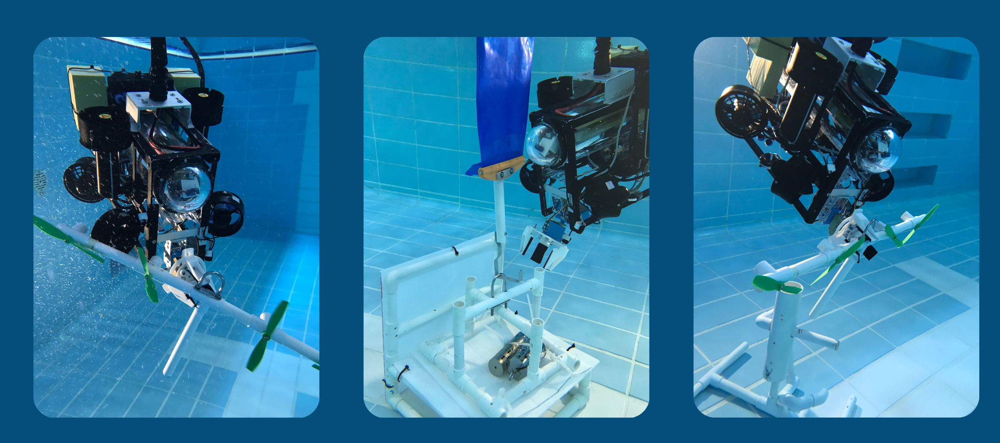

# STEAM 水下機器人項目
<link rel="stylesheet" type="text/css" href="./markdown-resource/fontawesome/all.min.css">
<link rel="stylesheet" type="text/css" href="./markdown-resource/fontawesome/fontawesome.min.css">
<link rel="stylesheet" type="text/css" href="./markdown-resource/fontawesome/brands.min.css">
<link rel="stylesheet" type="text/css" href="./markdown-resource/fontawesome/solid.min.css">
<link rel="stylesheet" type="text/css" href="./markdown-resource/fontawesome/regular.min.css">
<link rel="stylesheet" type="text/css" href="./markdown-resource/fontawesome/thin.min.css">
<link rel="stylesheet" type="text/css" href="./markdown-resource/fontawesome/light.min.css">
<link rel="stylesheet" type="text/css" href="./markdown-resource/fontawesome/duotone.min.css">
<link rel="stylesheet" type="text/css" href="./markdown-resource/fontawesome/sharp-solid.min.css">

> 保良局顏寶鈴書院 STEAM校隊 ROBOTICS GROUP 水下機器人二隊 
> Teammates: JP-YANG, Jasmine, Walter, Mark Chan, Kasey Chan

  
  
  

## Basic Introduction to ROV

An ROV (Remotely Operated Vehicle) 是一種用於勘探和檢查的無人水下機器人。測試ROV的地點在一樓的操場上，操場上有一個游泳池，可以親身體驗。
### About the ROV Competition
> 為了演示ROV的實際應用，每年都有新的挑戰。過去的挑戰包括使用ROV記錄環境變化，養殖海草，修復海上風電場或檢查水產養殖場。建造一個水下機器人很有趣，但為一個特定的目標建造一個更吸引人。參加MATE ROV比賽可以激勵學生，並幫助他們看到為共同目標而共同努力的價值。

If you want know more about it <b>VISIT THE COMPETITION WEBSITE:</b>

## MATE ROV 2025 Regional Competition  *Hong Kong China*

## USAGE OF ROV [User Guide]

## DEVELOPMENTS OF ROV [Technologies implementation]
**ROV的研發可以分為兩個主要部分：機械部分和軟件部分。**  
機械部分分為結構設計和電氣設計。 
軟件部分分為許多小的任務（包括：IMU、攝像頭、局域網通信、電機控制、伺服控制等），最後組合成一個完整的大系統。 
讓我們點擊下面的鏈接或按鈕來詳細看看！

GET STARTED WITH THE <b>MECHANICAL PART</b>: <i>./mechanical/</i>

GET STARTED WITH THE <b>SOFTWARE SYSTEM</b>: <i>./software-system/</i>

## Timeline and Contribution in our TEAM
您可以點擊下面的*鏈接*直接進入與Git提交記錄/時間軸/貢獻列表相關的不同統計頁面

- Git commit records 
- Main branch: https://github.com/Jason-JP-Yang/STEAM-ROV/commits/main/
- Develop branch: https://github.com/Jason-JP-Yang/STEAM-ROV/commits/develop
- Timeline: [TIMELINE.md](./TIMELINE.md)
- Contribution list: [CONTRIBUTION.md](./CONTRIBUTION.md)
### ***All Useful Links***

