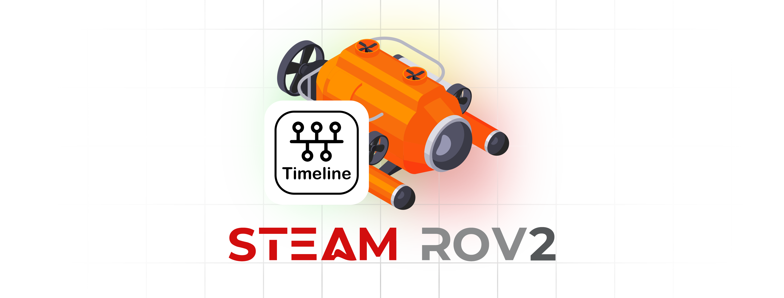

# ROV Project - TIMELINE
<link rel="stylesheet" type="text/css" href="./markdown-resource/fontawesome/all.min.css">
<link rel="stylesheet" type="text/css" href="./markdown-resource/fontawesome/fontawesome.min.css">
<link rel="stylesheet" type="text/css" href="./markdown-resource/fontawesome/brands.min.css">
<link rel="stylesheet" type="text/css" href="./markdown-resource/fontawesome/solid.min.css">
<link rel="stylesheet" type="text/css" href="./markdown-resource/fontawesome/regular.min.css">
<link rel="stylesheet" type="text/css" href="./markdown-resource/fontawesome/thin.min.css">
<link rel="stylesheet" type="text/css" href="./markdown-resource/fontawesome/light.min.css">
<link rel="stylesheet" type="text/css" href="./markdown-resource/fontawesome/duotone.min.css">
<link rel="stylesheet" type="text/css" href="./markdown-resource/fontawesome/sharp-solid.min.css">

> Hong Kong Po Leung Kuk Ngan Po Ling College Steam Team Robotics ROV Team 2  
> Teammates: JP-YANG, Jasmine, Walter, Mark Chan, Kasey Chan

## Timeline for 2024 - 2025
Here is the timeline of the development of the projects
Click the following buttons to direct to detail report of different tasks or event

| TIME                  | Tasks / Events                                                                                                          | Assigned to | Status                               |
| --------------------- | ----------------------------------------------------------------------------------------------------------------------- | ---------------------------------------- | ------------------------------------ |
| **<u>2024/10/26</u>** | **Developments**: **ESP32 communicate** with computer **through** LAN port (TCP/IP method) | Walter / Tiger                           | Working |
| **<u>2024/10/25</u>** | **Experiments**: Waterproof of 3D printed components                                       | Jason / Jasmine / Daniel                 | Preparing                            |
