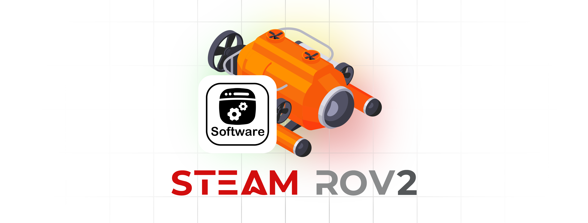

# ROV Project - ***Software System***
<link rel="stylesheet" type="text/css" href="./markdown-resource/fontawesome/all.min.css">
<link rel="stylesheet" type="text/css" href="./markdown-resource/fontawesome/fontawesome.min.css">
<link rel="stylesheet" type="text/css" href="./markdown-resource/fontawesome/brands.min.css">
<link rel="stylesheet" type="text/css" href="./markdown-resource/fontawesome/solid.min.css">
<link rel="stylesheet" type="text/css" href="./markdown-resource/fontawesome/regular.min.css">
<link rel="stylesheet" type="text/css" href="./markdown-resource/fontawesome/thin.min.css">
<link rel="stylesheet" type="text/css" href="./markdown-resource/fontawesome/light.min.css">
<link rel="stylesheet" type="text/css" href="./markdown-resource/fontawesome/duotone.min.css">
<link rel="stylesheet" type="text/css" href="./markdown-resource/fontawesome/sharp-solid.min.css">

> Hong Kong Po Leung Kuk Ngan Po Ling College Steam Team Robotics ROV Team 2  
> Teammates: JP-YANG, Jasmine, Walter, Mark Chan, Kasey Chan

  

## ***Structure of Software System of ROV***
*Updating...*
## Chips and devices information
Here is important information regarding the chips, along with device usage guidelines, similar to a PDF published by the manufacturers. Additionally, you will find resources related to these devices or chips.  
For new contributors working with these devices, we highly recommend that you thoroughly review the usage guidelines and datasheets provided. This foundational understanding will make building more easily!
### YD-ESP32-S3-N16R8 (espressif)
https://www.espressif.com.cn/zh-hans/products/socs/esp32-s3  
Click links below to redirect to have detail information: 
### MPU6050 (TDK InvenSense)
*Updating...*

## Software System
*Updating...*
### Anaconda (distribution of Python environment)
### Git (Include Github)
### Micropython (Version 1.19)
### Fusion / Inventor (Autodesk)